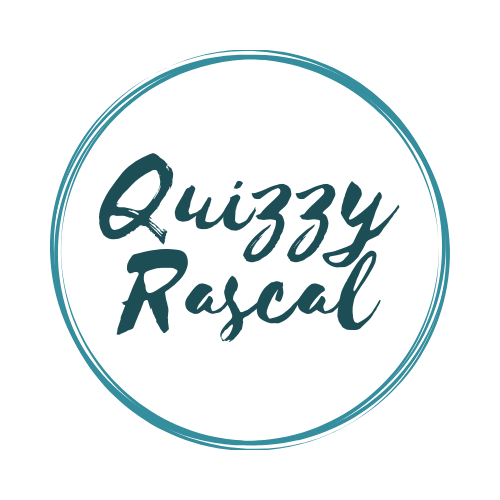
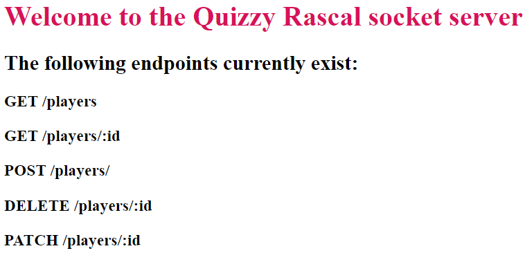
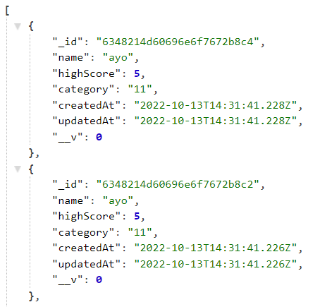
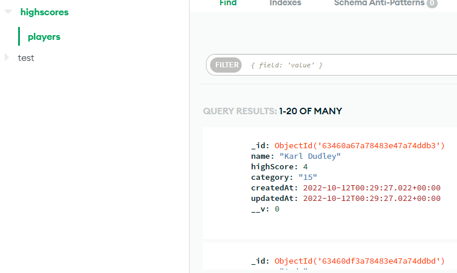
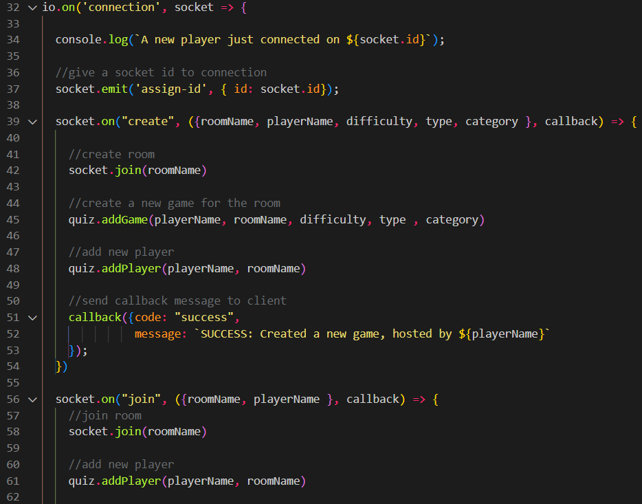
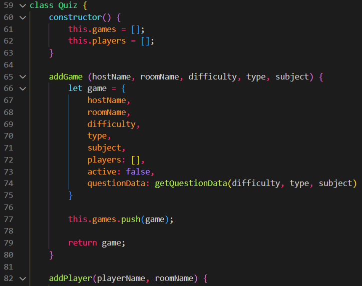
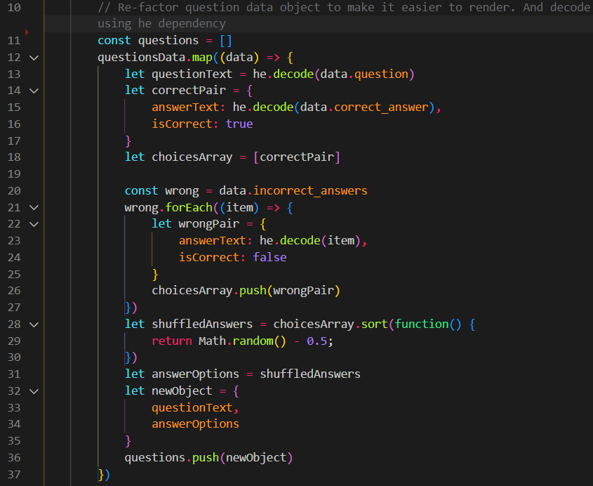
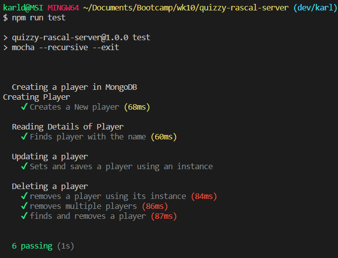

# Quizzy Rascal



## Project Description
### The aim of the project was to create an online quiz game where users can:
* play a game on their own or with other people
* choose the category of questions and difficulty
* answer questions simultaneously using web sockets
* see who the winner is at the end
* view high score lists

## Table of contents
1. [Installation](/README.md#installation-and-usage)
2. [Technologies](/README.md#technologies)
3. [API Endpoints](/README.md#api-endpoints)
4. [Website Preview](/README.md#website-preview)
5. [Process](/README.md#process)
6. [Wins & Challenges](/README.md#wins--challenges)
7. [Code Snippets](/README.md#code-snippets)
8. [Testing](/README.md#testing)
9. [Future Features](/README.md#future-features)
10. [Contributors](/README.md#contributors)

## Installation and Usage

### *For the deployed website:*
The deployed website can be found on [netlify](#).

### *For the deployed server:*
The deployed server can be found on [heroku](https://quizzy-rascal-server.herokuapp.com/).

### *To run locally:*
* Clone or download the [repo](https://github.com/karldudley/quizzy-rascal-server).
* Run ```npm install``` to install all required dependencies.
* Run ```npm run dev``` to start the server.
* Within the client folder, from index.html, start a live server and the website should be running locally.

### Please refer to [client repo](https://github.com/matthewlohl/quizzy-rascal-client) for instructions on how to run that locally.


## Technologies
* Server - Node.js
* DB - MongoDB Atlas
### *Planning*
* [Trello](https://trello.com/b/ElQcWq6X/make-it-happen)
* Figma
* Zoom/Slack
### *Dependecies*
* axios
* dotenv
* express
* cors
* mongoose
* jest
* mocha
* nodemon
* he
* socket.io

## API endpoints

| Route name | Path                                            | Method        | Purpose                            |
| ---------- | ----------------------------------------------- | ------------- | ---------------------------------- |
| show       | `/players/`                                      | `GET`         | Get all player scores              |
| show       | `/players/:id`                                   | `GET`         | Get player scores by category      |
| create     | `/players/`                                      | `POST`        | Post a new high score              |
| destroy    | `/players/:id`                                   | `DELETE`      | Delete a player high score         |
| update     | `/players/:id`                                   | `PATCH`       | Update a player high score         |


## Server and DB Screenshots
### *Server Home*


### *Players Endpoint*


### *Mongo DB*


## Wins & Challenges
### *Wins*
1. Implementing sockets.io to allow multiple users to play concurrently over the web
2. Posting high scores to MongoDB

### *Challenges*
1. Sockets.io - this was the first time we'd used this technology so the first day was a lot of learning and research.

## Code Snippets
### *Socket.io*


### *Quiz Class - created to deal with quiz data throughout game*


### *Refactor object received from trivia DB*


## Testing
#### We used Mocha to test the server because it had better functionality to test MongoDB

### *Players CRUD Testing*


## Future Features
- Ability to send chat messages between users during games
- Award more points for users who complete questions in a faster time
- More varity of questions

## Contributors

### [Liam Bolton](https://github.com/Leehamb99)
### [Karl Dudley](https://github.com/karldudley)
### [Matthew Lo](https://github.com/matthewlohl)
### [Ayo Soyannwo](https://github.com/Mounaiyk)


